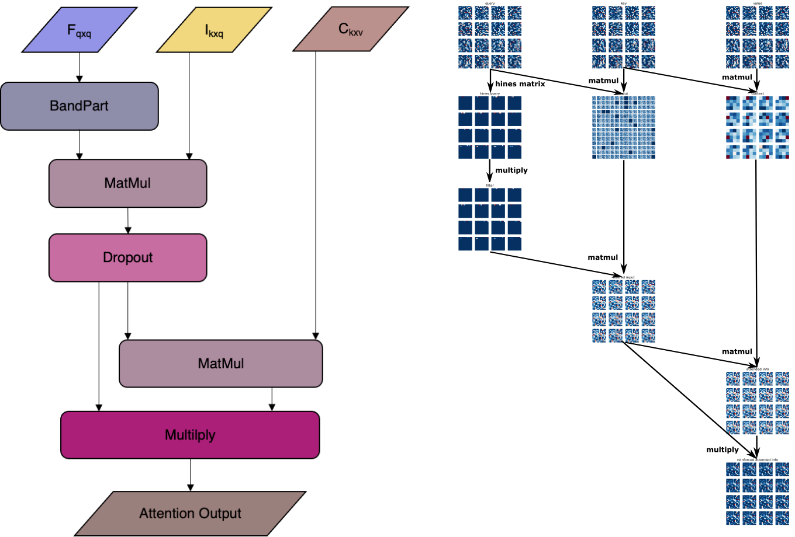
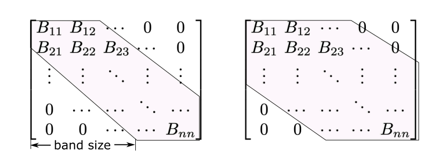

# SelectiveAttention

Self-attention as the corner component of Transformer is described in the paper - <I>Attention is all you need</I>.  Many biological concepts had been brought into AI field to build artificial neural network. The built AI models also contribute a lot in image and signal analysis in biological researches. To conceptually bring ideas from the biological visual pathway, we model it following the paradigm below:

Our work proposed in this work introduce the selective attention described in Feature-Integration Theory proposed by Treisman in 1980. Among the early V.S. late selection debates of selective attention theories, Feature-integration Theory clearly describe the process of information flow filtered and integrated to formulate the selectivity. The attended information flow is described as following:

We also use Hines Matrix to simulate the on- and off- settings at neuron-level of selective attention. As an abstractive method, the hines matrix may not conclude all the possible on- and off- setting distribution at neuron-level. 

We tested our methods on MNIST dataset, CIFAR-100, and ImageNet-1k dataset, the result shows a significant GPU memory saving up to 90%. It also shows slightly improvement in accuracy on classification of MNIST dataset.
